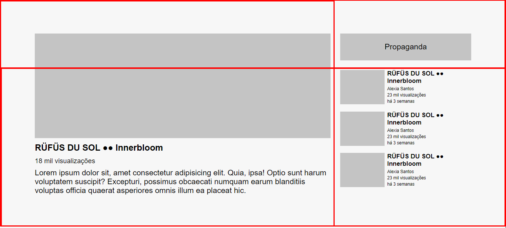

# Youtube-Layout

## Descrição
Este projeto é uma reprodução da tela principal do youtube, e foi idealizado para treinar os conhecimentos acerca da utilização 
do flexbox e do grid no CSS. 
O youtube é um site que a utilização do grid fica bastante evidente, pois é possível perceber a divisão em diversas caixas,
e é justamente isso que o grid proporciona, ao nosso visual.

##Layout e divisões

